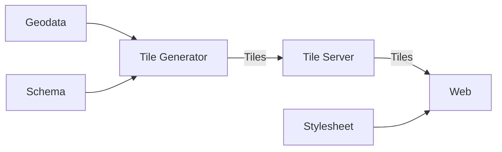
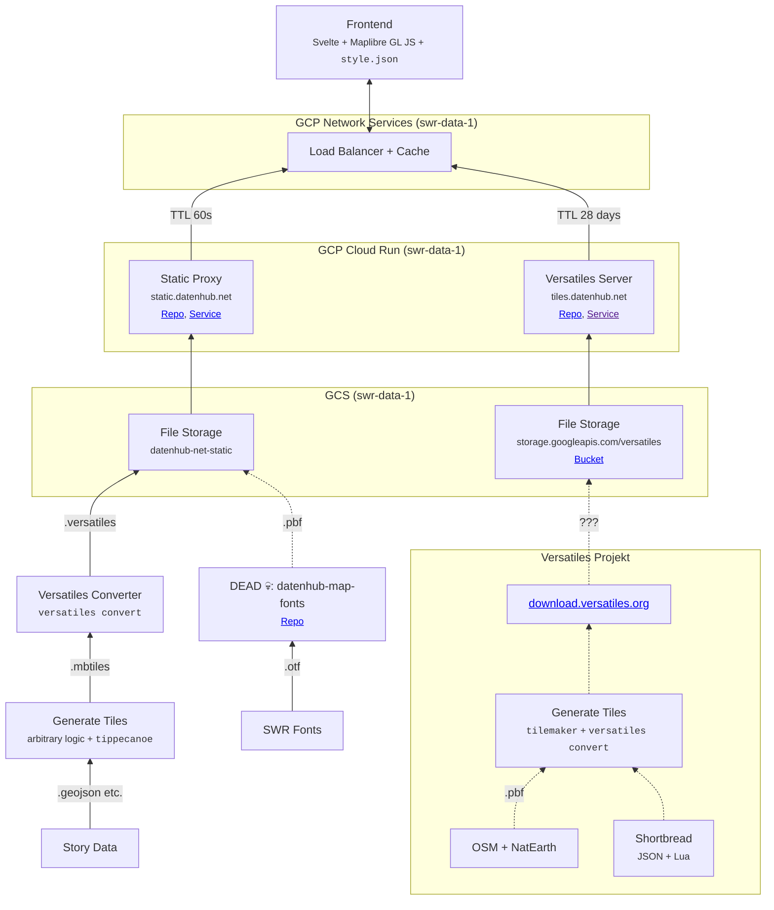

"Tiled web maps" is a term for interactive web maps you can pan, tilt and zoom and where data is loaded dynamically as you need it. They're also referred to as "slippy maps", a term popularised by [OpenStreetMap](https://wiki.openstreetmap.org/wiki/Slippy_map) in the mid-2000s.

## Building a general-purpose tiled web map

- You find

- Man zieht sich Kartendaten (typischerweise von OSM, aber NaturalEarth und andere Dienste werden auch verwendet)
- Diese Daten werden von einem Tile Generator vereinfacht, in Ebenen unterteilt und in Kacheln verschiedener Zoom-Stufen aufgeteilt
- Die Kacheln liefert ein spezieller Tile Server über HTTP aus
- Ein spezielles Javascript Frontend rendert diese Kacheln und erzeugt die interaktive UI. Die visuelle Reihenfolge der Ebenen, Farben, Schriften usw. wird erst hier durch ein JSON Stylesheet definiert.

Wir haben diesen Workflow mehr oder weniger implementiert. Insbesondere haben wir zwei separate Tileserver:

1. Ein Proxy-Service, der alle Requests nach static.datenhub.net bekommt. Das ist ein Node-Service aus dem Versatiles Projekt ([@versatiles/google-cloud](https://github.com/versatiles-org/node-versatiles-google-cloud)). Die meisten Requests werden einfach durchgereicht aber es gibt einen [Special Case](https://github.com/versatiles-org/node-versatiles-google-cloud/blob/3b276f80f325c5921c339ee967a1edb575491edb/src/lib/server.ts#L94-L99) für Requests auf `*.versatiles`-Dateien. Wenn so einer kommt werden die GET-Parameter und die Container-Datei geparst, und mit dieser Info die richtige Kachel ausgeliefert. Deshalb funktionieren Requests wie: `GET https://static.datenhub.net/data/zensus-test/zensus2011e.versatiles?tiles/7/67/42` [^1]
2. Ein `versatiles-rs` tileserver, der OSM-Daten und Gemeinden ausliefert.

## Building a custom maplibre style

## Prior work

- https://github.com/SWRdata/zensus-gitter-test
- https://github.com/SWRdata/dokumentation-kreil
- [datenhub-tiles-server](https://github.com/SWRdata/datenhub-tiles-server) (Deprecated)
- [datenhub-static-server](https://github.com/SWRdata/datenhub-tiles-proxy) (Deprecated)
- [datenhub-map-fonts](<[text](https://github.com/SWRdata/datenhub-map-fonts)>), see: https://github.com/versatiles-org/versatiles-fonts/issues/11 (Deprecated)

## References

- https://www.geofabrik.de/projects/residential_areas/index.html
- https://osmcode.org/osmium-tool/manual.html#filtering-by-tags
- Can't use GCP geocoding because: 3.3: https://cloud.google.com/maps-platform/terms/maps-service-terms, see also: https://developers.google.com/maps/documentation/geocoding/policies#map
- https://locationiq.com/geocoding
- https://www.geofabrik.de/data/geocoding.html
- Useful OSM dumps: https://download.geofabrik.de/europe/germany.html
- https://www.muckrock.com/news/archives/2024/feb/13/release-notes-how-to-make-self-hosted-maps-that-work-everywhere-cost-next-to-nothing-and-might-even-work-in-airplane-mode/
- https://github.com/maplibre/font-maker

[^1]: Das sieht so ähnlich aus wie ein HTTP-Range-Requests im pmtiles-Format, [ist es aber nicht](https://github.com/versatiles-org/versatiles-rs/issues/24#issuecomment-1517567677)
